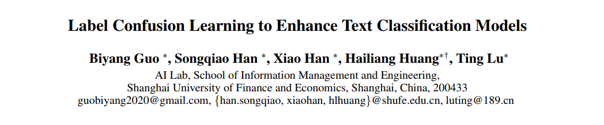
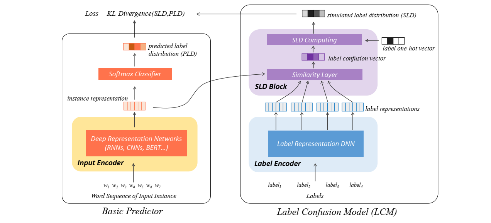
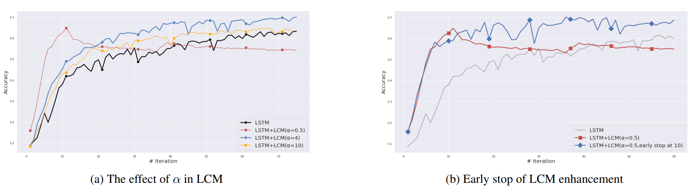

### Description:

This is the official implementation of our AAAI-21 accepted paper *Label Confusion Learning to Enhance Text Classification Models*.

The structure of LCM looks like this:

Here we provide some demo experimental code & datasets. 

### Environment:

python 3.6
tensorflow 2.2.0
keras 2.3.1

### Run a Demo:

**LCM-based LSTM:**

Run `python lcm_exp_on_lstm.py` to compare the performance of  LSTM, LSTM with label smoothing(LS) and LSTM with LCM.

**LCM-based BERT:**

Run `python lcm_exp_on_bert.py` to compare the performance of  BERT, BERT with label smoothing(LS) and BERT with LCM.

The final results will be outputted to `output/` directory.

The curve below shows our results on 20NG with LSTM as basic predictor. By changing the α, we can control the influence of LCM on the original model. 

